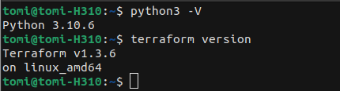
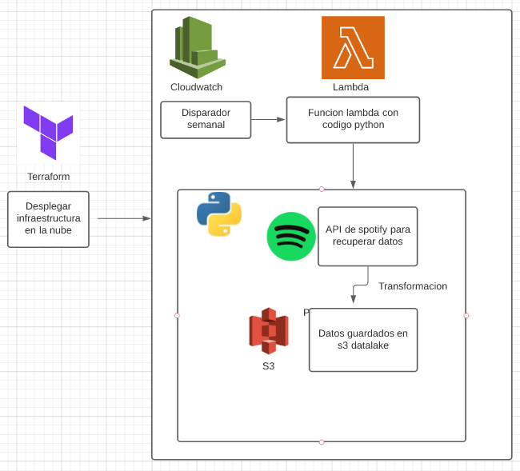

# Spotify Analysis

## Contenidos
1. [Instalación](#instalación) 
2. [Uso](#uso)
3. [Arquitectura del proyecto](#arquitecturadelproyecto)

## Instalación 

#### Pre-Requisites
Asegúrese de tener Python y Terraform instalados correctamente en su máquina. Puede verificar si están instalados correctamente ejecutando los siguientes comandos en una terminal:

Enlaces para descargarlos:
[Python](https://www.python.org/downloads/), [Terraform](https://www.terraform.io/downloads.html) y [Spotipy](https://spotipy.readthedocs.io/en/2.13.0/).

Otra cosa importante!
También necesitará una cuenta de [AWS](https://aws.amazon.com/es/?nc2=h_lg) , si aún no tiene una, entonces es elegible para una [cuenta de 'nivel gratuito'](https://aws.amazon.com/es/free/?all-free-tier.sort-by=item.additionalFields.SortRank&all-free-tier.sort-order=asc&awsf.Free%20Tier%20Types=*all&awsf.Free%20Tier%20Categories=*all) de un año . Esta cuenta le permite acceder a algunas de las funciones más populares de AWS de forma gratuita.

## Uso
Ejecute los scripts con un diccionario de sus artistas favoritos o listas de reproducción para recopilar datos sobre ellos y guardarlos localmente o en S3.

## Arquitectura del proyecto

Los scripts de Terraform construyen:
- Una función lambda con el código de análisis.
- Una alarma de vigilancia en la nube para ejecutar esa función semanalmente
- Todas las políticas/roles de IAM relevantes

Esto generará un lago de datos de Spotify localmente o en S3.
